# Hands-On Lab #1 - Data Storage

The goals for this session are to understand data storage options available to us and to ingest data so that it can be processed.

## Task 1: Create Storage Account
* Log into Microsoft Azure 
* Create a resource group for labs (e.g. rg-bigdata-[name])
* Create an Azure Storage Account (e.g. stgbigdata[name])

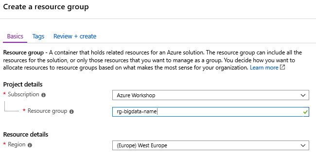
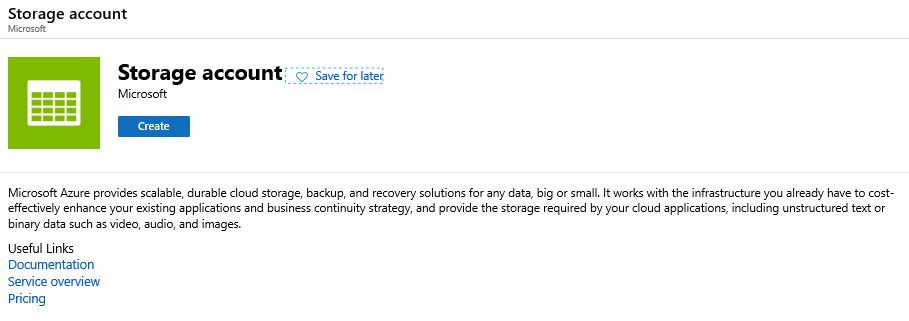
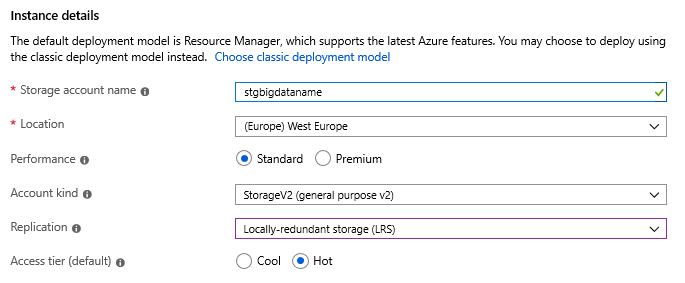

* Make sure the storage account is configured for HTTPS only and a Hierarchical Namespace filesystem (i.e. Data Lake Gen2 Storage).

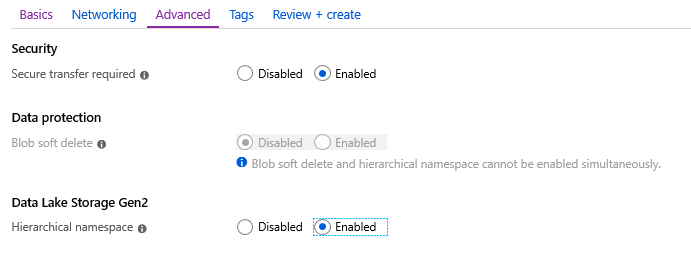

## Task 2: Download and configure Azure Storage Explorer

* Download and install the software ([link](https://go.microsoft.com/fwlink/?LinkId=708343&clcid=0x809))
* Configure connection to Storage Account
* Create a default filesystem in the Storage Account
* Setup default POSIX security settings

## Task 3: Create an Azure Data Factory

* Open Azure Portal
* Create an Azure Data Factory service

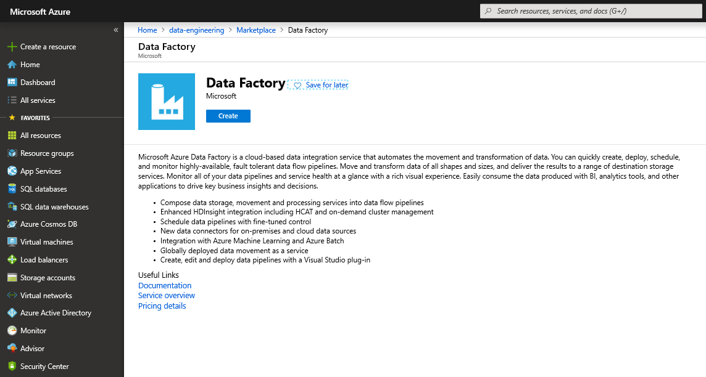

* View the service and click the *Author & Monitor* link

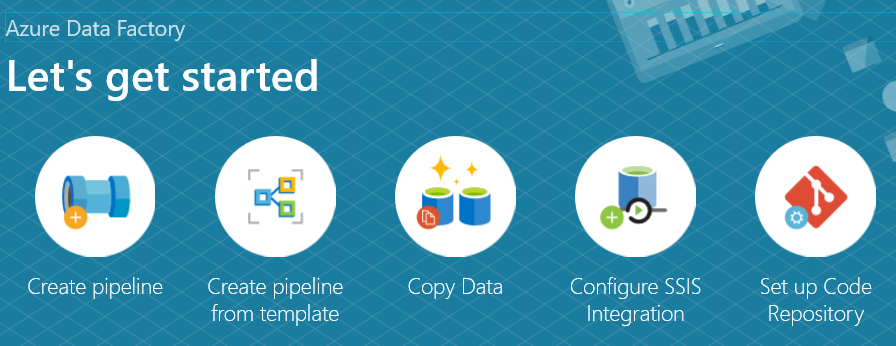

* Create a pipeline
* Add a copy file shape to the pipeline and configure

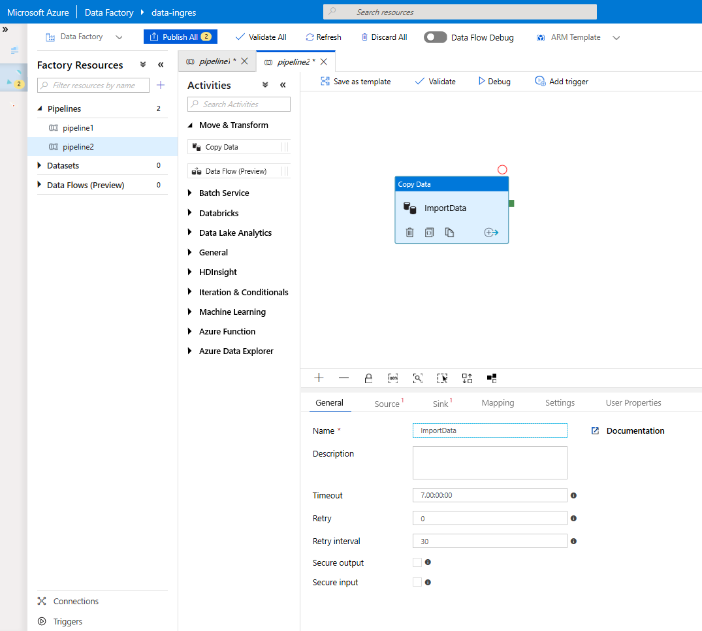

*A copy shape has both a **source** from which data is loaded and a **sink** where data is saved*. Each of these must be configured to import data.*

### Source Setup

* Create a new dataset (Call this ReferenceData)
* Select the HTTP data source
* Select the Parquet data format
* Set the properties (Name = ReferenceData, LinkedService = New)
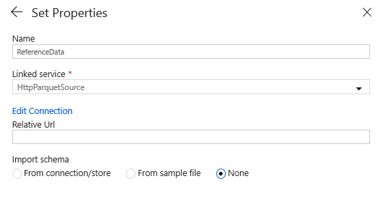
* Setup the Linked Service Properties (Base URL will be provided)
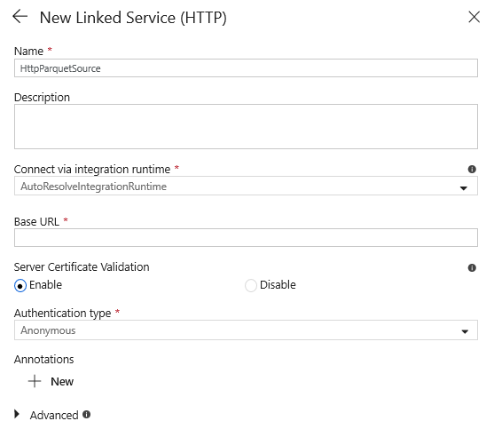

### Sink Setup
* Create a new dataset (Call this DataLake)
* Select the Azure Data Lake Storage Gen2 format
* Select the Parquet data format
* Set the properties (Name = Data, LinkedService = New)
* Setup the Linked Service Properties (Settings are found on the Data Lake Storage Gen2 created above)
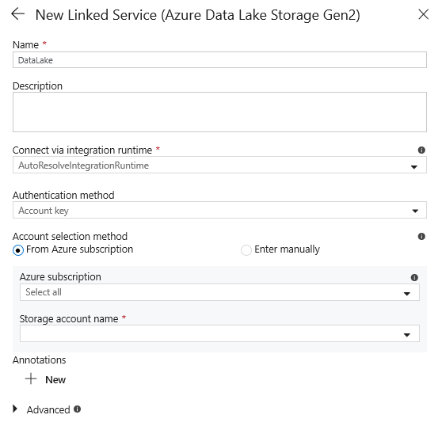
* Confirm the sink properties
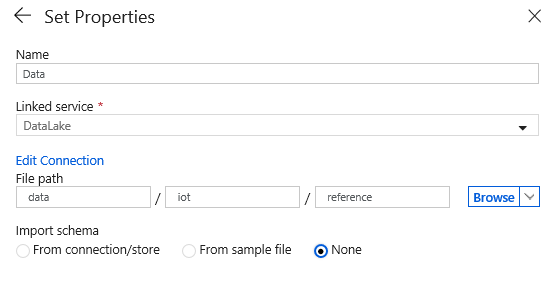
* The pipeline properties should be:
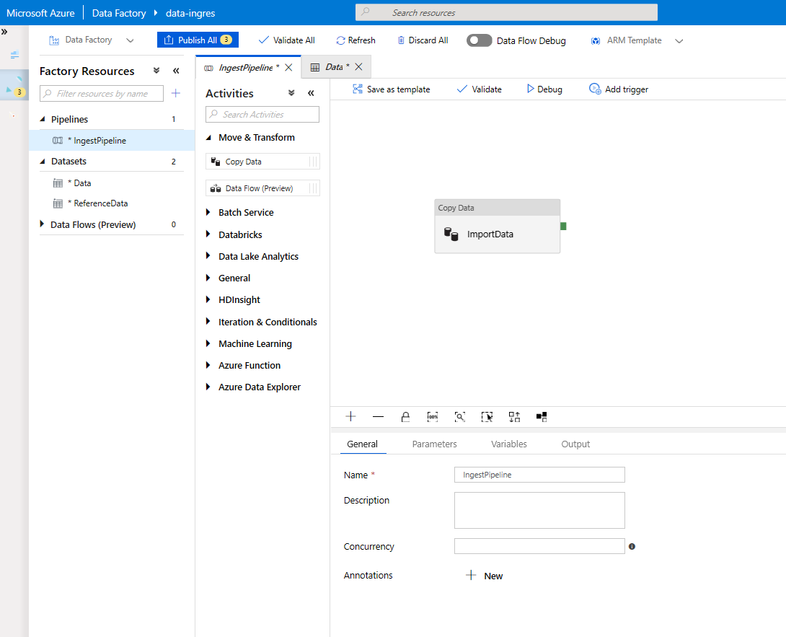
* Now click **Validate All** to validate the settings
* Click **Publish All** to publish and activate the pipeline
* The pipeline can now be triggered

## Task 4: Trigger the pipeline

* Still in Azure Data Factory
* In the Pipeline editor click the **Add trigger** button
* This will open a panel on the right of the view
* Validate the information that is shown
* Click **Finish** at the bottom of the panel

## Task 5: Verify the file has been copied

* View the **Monitor** page in Azure Data Factory
* Verify the pipeline has fully executed and was successful

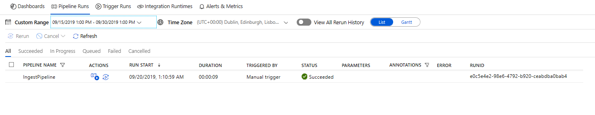

* Open Azure Storage Explorer and browse to output location
* Verify the file has been created

**Now ready for [Lab2](../lab2/lab2.md)**
