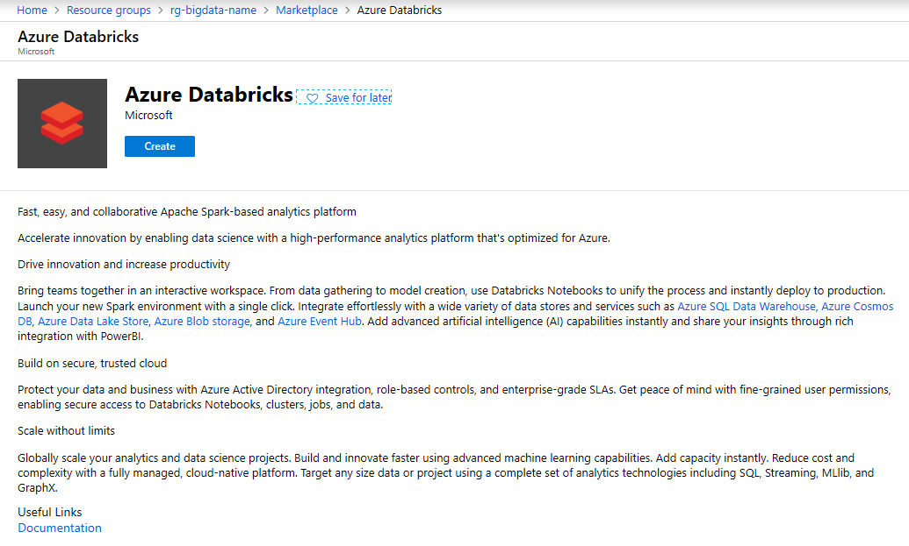
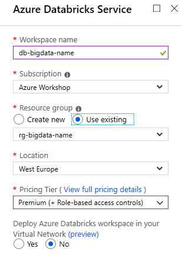

# Hands-On Lab #2 - Batch Processing

This lab will create an **Azure Databricks Workspace** that can be used for batch processing.

## Task 1: Create Databricks Workspace

* Login to Azure Portal
* Browse to resource group from Lab 1 (rg-bigdata-{name})
* Create a new Databricks service. Ensure Notebooks are available.




* Once deployed, browse to the resource and click the **Launch Workspace** button


* Login with Azure AD account
* In Databricks, create a new development cluster. Use the smallest size for most efficient price point.


* Make sure the following libraries are installed as Maven coordinates

```
com.microsoft.azure:azure-eventhubs-spark_2.11:2.3.10
com.microsoft.azure:azure-sqldb-spark:1.0.2
org.mongodb.spark:mongo-spark-connector_2.11:2.3.1
```

## Task 2: Create a notebook and connect to Storage Account

* Open the workspace section in Databricks and create a new Notebook


* Open the new Notebook and begin editing

```python
#########################################################
## SETUP DATALAKE ACCESS                               ##
#########################################################
account = '<datalake account name>'
key = '<datalake account key>'
file_system = 'iot'
```

* Load the data source **this will have been imported as part of [Lab 1](../lab1/lab1.md)**

```python
#########################################################
## LOAD REFERENCE DATA                                 ##
#########################################################
df = spark.read.parquet('abfss://%s@%s.dfs.core.windows.net/academy/reference' % (file_system, account))
df.persist()
```

* Execute a query and display the Data Frame

```python
# filter just telemetry records and count the number of messages per device
data = df \
  .filter(df['iothub-message-source'] == 'Telemetry') \
  .select(df['iothub-connection-device-id'].alias('device')) \
  .groupBy('device') \
  .count()

#display the results
display(data)
```

* Create a view of the DataFrame

```python
#########################################################
## CREATE SQL VIEW OF DATA                             ##
#########################################################
df.createOrReplaceTempView('iot')
```

* Query the dataframe using SQL

```sql
%sql
SELECT 
  `iothub-connection-device-id` as device,
  count(1) as count
FROM iot
WHERE `iothub-message-source` = 'Telemetry'
GROUP BY `iothub-connection-device-id`
```

## Task 3: Perform some calculations on the data

[Spark SQL Programming Guide](https://spark.apache.org/docs/2.4.0/sql-programming-guide.html)

* Load a reference file from the Data Lake
* Create a query to join data with the reference data
* Select the columns to display
* MapReduce **TODO: create example code**
* Reduce the Data Frame to an aggregated value
* Visualise the data by selecting a graphing option

**Now ready for [Lab3](../lab3/lab3.md)**