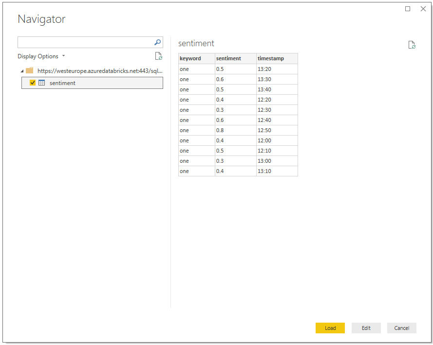

# Hands-On Lab #4 - Visualisation

## Task 1: Install Power BI Desktop

* [Power BI Desktop](https://aka.ms/pbidesktopstore)
* [ODBC Driver](http://info.databricks.com/K00ynYM00hUp0goqD06C0S0)

## Task 2: Connect Power BI Desktop to Databricks

* Open User Settings in Databricks


* Generate an access token

*Note: The access token is only ever visible once when created. If you lose the token, repeat this step to generate a new one*


* Open PowerBI Desktop
* Get Data


* Make sure your Databricks cluster is running or connections will fail. Also make sure that notebooks are detached to allow queries to execute.

* Spark




## Task 3: Add a table to view data

 * Click the table icon and choose columns to display


 * Refresh the data in the report to display values


## Task 4: Add a line chart to show metrics by temporal window

 * Click the Line Chart icon


 * Set the axis to be **timestamp**
 * Set the legend to be **keyword**
 * Set the values to be **sentiment**


## Stretch Goals

### Create a SQL Server in Azure
SQL Server can produce faster response times for Power BI.
Create the **Azure SQL Database** service in Azure and configure for PowerBI.
Enable access through the SQL Server firewall.
Update your notebook to also save temporal data to SQL Server

```python
batch.write.format('jdbc')\
  .mode('append')\
  .option('url', 'jdbc:sqlserver://<sql server>:1433;databaseName=<db>')\
  .option('dbtable', 'twitter.sentiment')\
  .option('user', '<username>')\
  .option('password', '<password>')\
  .option('driver', 'com.microsoft.sqlserver.jdbc.SQLServerDriver')\
  .save()
```

Create a new data source in PowerBI that also references this SQL Server.

